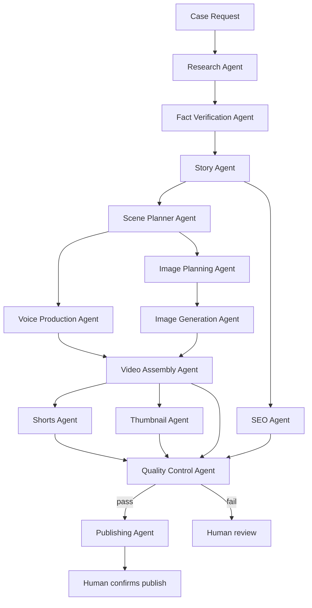

# Architecture

## What an "Agent" actually is here

The brief asks for cooperating specialized agents (Research, Story, Scene Planner, Voice,
Image, Assembly, Thumbnail, SEO, QC, Publishing, Tool Manager...). In this repo, an Agent is:

- A **system prompt** (`Agents/<name>.md`) that defines role, input schema, output schema,
  and escalation rules.
- Invoked as one **node in the orchestrator** (n8n) that calls the Anthropic API with that
  system prompt plus the current input payload.
- Stateless between calls. All "memory" is explicit: files (`SuccessRules.md`,
  `tool_registry.json`) that get read back in on the next run.

This matters because it keeps the system debuggable: every agent is a single, inspectable API
call with a fixed contract, not a black box "AI running in the background."

## Pipeline



**Shorts Agent runs immediately after Video Assembly Agent** — not a separate, later pass. It
selects moments from the finished render and writes each Short its own hook; see
`Agents/shorts_agent.md` and the "Shorts & captions requirement" section below.

Cross-cutting: **Tool Manager Agent** runs before any new script is written anywhere in the
pipeline — not as a pipeline stage, but as a standing check against `Tools/tool_registry.json`.

## Data contracts (which Template each stage produces/consumes)

| Stage | Produces | Consumes |
|---|---|---|
| Research | raw case data, sources, `genre_trend_notes` | case query |
| Fact Verification | verified/flagged claims | raw case data |
| Story | `Templates/Script.md` (draft) | verified claims |
| Scene Planner | scene list (timestamps, beats) | Script.md |
| Voice Production | `Templates/Voiceover.txt` | scene list |
| Image Planning | `Templates/ImagePrompts.md` | scene list |
| Image Generation | files in `Assets/images/` | ImagePrompts.md |
| Video Assembly | draft render in `Assets/renders/` | Voiceover audio + images + timestamps |
| Shorts | `Templates/Shorts.md` | final render + scene list (runs right after Video Assembly) |
| Thumbnail | `Templates/Thumbnail.md` | case summary/twist |
| SEO | `Templates/SEO.md` | Script.md + `Templates/SuccessRules.md` |
| Quality Control | `Templates/Checklist.md` | everything above, including Shorts.md |
| Publishing | publish plan (human-gated) | Checklist.md = pass |

`Templates/Sources.md` is written continuously by Research + Fact Verification, not as a
single stage.

## Trend-grounding requirement (added 2026-07-19, after a Stage 1 SEO Agent test)

Testing surfaced two related bugs: `Agents/seo_agent.md` asked for a fixed tag/hashtag *count*
with no awareness of YouTube's actual limits (tags: 500-character total budget, not a tag
count; hashtags: over 15 anywhere gets all of them ignored, practical range 3-5), and neither
Research Agent nor SEO Agent had a real mechanism for "current trends" — the system prompts
said to "analyze current YouTube trends" but had no tool behind that instruction, so it was
being asserted from training knowledge rather than checked. Both are fixed in the agent files
themselves, but the underlying rule is a permanent one, not just a one-off patch:

- **Research Agent must run a real web search on current true-crime genre/format trends every
  run** (output field `genre_trend_notes`), not assert trends from memory. Genre trends shift;
  stale assumptions produce generic filler, not real signal.
- **`viral_potential_notes` (per-candidate) and `genre_trend_notes` (genre-wide) must be
  grounded in something actually checkable** — real outlet coverage found, a real search result
  — never a bare "this could go viral" assertion.
- **A trending frame must never override the facts.** If "unsolved mystery" content is
  currently trending but a candidate case is solved and adjudicated, that mismatch gets flagged,
  not papered over — forcing a trending frame onto a case it doesn't fit is exactly the
  clickbait-lie behavior this channel's agents are built to avoid (see Story/SEO Agents' rules
  against overselling beyond verified facts).
- **SEO Agent must produce output ready to paste with no manual trimming** — verify the tag
  string's actual character count and hashtag count before finalizing, don't just target a
  round number and hope it fits.

## Shorts & captions requirement (added 2026-07-19, after a user review of the pipeline)

Two real gaps surfaced: subtitles had no defined style at all (risk of ending up small/low-
contrast, which is not how the format performs in 2026), and no agent owned "decide which
moments become Shorts and write each one's own hook" — Publishing Agent's input schema just
assumed `shorts: [...]` already existed with content, hooks, and titles. Both fixed with real
research grounding, not guesses:

- **New `Agents/shorts_agent.md`**, running immediately after Video Assembly Agent produces the
  final render (not a separate later pass). It selects standalone-worthy moments and writes each
  Short its own hook — never a reworded copy of the main video's Hook beat, since a Short has
  ~3 seconds to work with and a different job to do.
- **Hard 45-second cap per Short.** Research (2026 completion-rate/view-count data across a
  5,400-Short sample) shows 30-45s is the actual sweet spot for total views and algorithm
  weighting — not the shorter caps that maximize completion % alone but under-perform on raw
  views and rewatch signal.
- **One hook per Short: a single bold claim or curiosity gap, landing in under 3 seconds.**
  50-60% of Shorts drop-off happens in the first 3 seconds; never stack two promises.
- **Captions are a fixed, brand-consistent style, not an afterthought** (see
  `Tools/remotion_assembly_tool.md`'s "Caption style" section): bold Montserrat (the channel's
  existing body font), white text with a black stroke, word-by-word karaoke-style highlight in
  the channel's existing accent color (`#A30E15`), centered lower-third, minimum 2 seconds
  on-screen per phrase. This is the dominant 2026 short-form caption style (the CapCut/Hormozi
  look), not a stylistic guess — captions measurably improve completion rate 12-15%.
- **Assume sound-off for every Short.** 60%+ of viewers watch muted, so the on-screen hook text
  must carry the meaning alone, not just reinforce narration.

## Error handling

Every agent returns:

```json
{ "status": "ok | warning | error", "output": {...}, "notes": "string" }
```

- `warning` → pipeline continues, note is logged into `Checklist.md`.
- `error` on a non-critical stage (e.g. one image failed to generate) → pipeline continues,
  missing asset flagged, never blocks the whole run.
- `error` on a critical stage (fact verification fails on a load-bearing claim, QC fails) →
  pipeline halts *that stage*, produces a report, and waits for a human decision. It does not
  silently publish a video with an unverified core claim.

## Where human judgement is required (not automatable, on purpose)

- Choosing between two viable case candidates when viral potential is close (Story Agent
  escalates instead of silently deciding — this matches how the channel's own case-selection
  disagreement, documented in `fatal-affairs-project-brief.md`, was actually resolved).
- Any QC "fail" status.
- Legal/ethical concerns about a specific case or claim.
- The final publish action (see `Agents/publishing_agent.md`) — this stays a confirm-gated
  step even in an otherwise "autonomous" pipeline, the same way an irreversible public action
  would need explicit confirmation in any other context.

## What this repo deliberately does not claim

It does not run itself. There is no persistent process anywhere in this repo that wakes up and
produces a video unattended. It is a set of contracts and scaffolds meant to be wired into a
real orchestrator (n8n) with real credentials by something with actual execution access
(Claude Code, or a human developer) — see `HANDOFF_TO_CLAUDE_CODE.md`.
