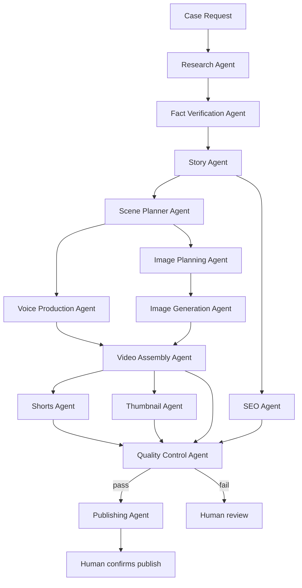

# Architecture

## What an "Agent" actually is here

The brief asks for cooperating specialized agents (Research, Story, Scene Planner, Voice,
Image, Assembly, Thumbnail, SEO, QC, Publishing, Tool Manager...). In this repo, an Agent is:

- A **system prompt** (`Agents/<name>.md`) that defines role, input schema, output schema,
  and escalation rules.
- Invoked as one **node in the orchestrator** (n8n) that calls the Anthropic API with that
  system prompt plus the current input payload.
- Stateless between calls. All "memory" is explicit: files (`SuccessRules.md`,
  `tool_registry.json`) that get read back in on the next run.

This matters because it keeps the system debuggable: every agent is a single, inspectable API
call with a fixed contract, not a black box "AI running in the background."

## Pipeline



**Shorts Agent runs immediately after Video Assembly Agent** — not a separate, later pass. It
selects moments from the finished render and writes each Short its own hook; see
`Agents/shorts_agent.md` and the "Shorts & captions requirement" section below.

Cross-cutting: **Tool Manager Agent** runs before any new script is written anywhere in the
pipeline — not as a pipeline stage, but as a standing check against `Tools/tool_registry.json`.

## Data contracts (which Template each stage produces/consumes)

| Stage | Produces | Consumes |
|---|---|---|
| Research | raw case data, sources, `genre_trend_notes` | case query |
| Fact Verification | verified/flagged claims | raw case data |
| Story | `Templates/Script.md` (draft) | verified claims |
| Scene Planner | scene list (timestamps, beats) | Script.md |
| Voice Production | `Templates/Voiceover.txt` | scene list |
| Image Planning | `Templates/ImagePrompts.md` | scene list |
| Image Generation | files in `Assets/images/` | ImagePrompts.md |
| Video Assembly | draft render in `Assets/renders/` | Voiceover audio + images + timestamps |
| Shorts | `Templates/Shorts.md` | final render + scene list (runs right after Video Assembly) |
| Thumbnail | `Templates/Thumbnail.md` | case summary/twist |
| SEO | `Templates/SEO.md` | Script.md + `Templates/SuccessRules.md` |
| Quality Control | `Templates/Checklist.md` | everything above, including Shorts.md |
| Publishing | publish plan (human-gated) | Checklist.md = pass |

`Templates/Sources.md` is written continuously by Research + Fact Verification, not as a
single stage.

## Trend-grounding requirement (added 2026-07-19, after a Stage 1 SEO Agent test)

Testing surfaced two related bugs: `Agents/seo_agent.md` asked for a fixed tag/hashtag *count*
with no awareness of YouTube's actual limits (tags: 500-character total budget, not a tag
count; hashtags: over 15 anywhere gets all of them ignored, practical range 3-5), and neither
Research Agent nor SEO Agent had a real mechanism for "current trends" — the system prompts
said to "analyze current YouTube trends" but had no tool behind that instruction, so it was
being asserted from training knowledge rather than checked. Both are fixed in the agent files
themselves, but the underlying rule is a permanent one, not just a one-off patch:

- **Research Agent must run a real web search on current true-crime genre/format trends every
  run** (output field `genre_trend_notes`), not assert trends from memory. Genre trends shift;
  stale assumptions produce generic filler, not real signal.
- **`viral_potential_notes` (per-candidate) and `genre_trend_notes` (genre-wide) must be
  grounded in something actually checkable** — real outlet coverage found, a real search result
  — never a bare "this could go viral" assertion.
- **A trending frame must never override the facts.** If "unsolved mystery" content is
  currently trending but a candidate case is solved and adjudicated, that mismatch gets flagged,
  not papered over — forcing a trending frame onto a case it doesn't fit is exactly the
  clickbait-lie behavior this channel's agents are built to avoid (see Story/SEO Agents' rules
  against overselling beyond verified facts).
- **SEO Agent must produce output ready to paste with no manual trimming** — verify the tag
  string's actual character count and hashtag count before finalizing, don't just target a
  round number and hope it fits.

## Shorts & captions requirement (added 2026-07-19, after a user review of the pipeline)

Two real gaps surfaced: subtitles had no defined style at all (risk of ending up small/low-
contrast, which is not how the format performs in 2026), and no agent owned "decide which
moments become Shorts and write each one's own hook" — Publishing Agent's input schema just
assumed `shorts: [...]` already existed with content, hooks, and titles. Both fixed with real
research grounding, not guesses:

- **New `Agents/shorts_agent.md`**, running immediately after Video Assembly Agent produces the
  final render (not a separate later pass). It selects standalone-worthy moments and writes each
  Short its own hook — never a reworded copy of the main video's Hook beat, since a Short has
  ~3 seconds to work with and a different job to do.
- **Hard 45-second cap per Short.** Research (2026 completion-rate/view-count data across a
  5,400-Short sample) shows 30-45s is the actual sweet spot for total views and algorithm
  weighting — not the shorter caps that maximize completion % alone but under-perform on raw
  views and rewatch signal.
- **One hook per Short: a single bold claim or curiosity gap, landing in under 3 seconds.**
  50-60% of Shorts drop-off happens in the first 3 seconds; never stack two promises.
- **Captions are a fixed, brand-consistent style, not an afterthought** (see
  `Tools/remotion_assembly_tool.md`'s "Caption style" section): bold Montserrat (the channel's
  existing body font), white text with a black stroke, word-by-word karaoke-style highlight in
  the channel's existing accent color (`#A30E15`), centered lower-third, minimum 2 seconds
  on-screen per phrase. This is the dominant 2026 short-form caption style (the CapCut/Hormozi
  look), not a stylistic guess — captions measurably improve completion rate 12-15%.
- **Assume sound-off for every Short.** 60%+ of viewers watch muted, so the on-screen hook text
  must carry the meaning alone, not just reinforce narration.

## Research yield / discovery-sources requirement (added 2026-07-19, after a user concern about
video-pipeline volume)

The channel's Phase 1 goal is 10 test videos, and a single Research Agent test run only
produced 2-3 candidates that cleared the 5-source bar out of 5 requested — a real yield problem
worth addressing, not just noting. Two fixes:

- **Added DOJ/US Attorney/state AG/DA press releases as a top-tier citation source**
  (`justice.gov/usao/pressreleases` and equivalent state/county pages) — these are primary-source
  prosecution announcements, searchable by jurisdiction/date/offense type, and were missing
  entirely from the original source list despite being at least as authoritative as AP/ABC/CBS/NBC
  reporting on the same cases.
- **Separated "discovery" from "citation" sources.** The original source-priority list was meant
  to govern what a *claim* can be cited to, but its phrasing also read as restricting *where to
  look for candidates* — which isn't the same thing and was likely suppressing yield. Forums
  (r/TrueCrime, r/UnresolvedMysteries, Websleuths) are now explicitly fine for finding candidate
  leads, same as before for verification: never citable as fact, but a legitimate way to surface
  cases worth then researching properly.
- **Explicit yield guidance:** a thin result (1-2 usable candidates out of 5 requested) is a
  signal to widen the search — more candidates requested, broader niche, or the discovery
  sources above — not a result to settle for. See `Agents/research_agent.md`'s "Yield note".
- **Validated with a real search, not just asserted:** a `justice.gov`-targeted search for
  affair/betrayal murder sentencings immediately surfaced several real candidates not found in
  the original general web search pass (a murder-for-hire plot targeting an ex-wife and her
  boyfriend, a husband sentenced for killing his wife in a parking lot, a man sentenced for
  killing his ex-partner, among others) — confirming this source genuinely increases yield
  rather than just sounding plausible.

## Background music requirement (added 2026-07-19, after a user review of the pipeline)

Neither `Agents/video_assembly_agent.md` nor `Tools/remotion_assembly_tool.md` specified
background music at all before this — a real gap, since the channel's Netflix-documentary tone
depends on it. Fixed with real research grounding:

- **`Tools/elevenlabs_voice_tool.md` extended with `generate_music()`** (the real Eleven Music
  API — mood prompt + style tags, `music_length_ms` for duration) rather than adding a new tool,
  per the same `extend_existing` logic Tool Manager Agent now supports.
- **Superseded as the default the same day:** Eleven Music charges per-generation credits, and
  the channel owner wants this sourced free instead. New `Tools/royalty_free_music_tool.md`
  was added; `generate_music()` is now the fallback.
- **Confirmed, not just flagged (2026-07-19, by directly reading Pixabay's live API docs page in
  a browser):** Pixabay's public REST API only covers Search Images and Search Videos — there is
  no music/audio-search endpoint at all, "music" is merely a category filter on those two.
  YouTube Audio Library has no public API either. Freesound has a real API but requires separate
  commercial licensing to use for a monetized channel, and is more of an SFX library than a
  music-bed one. **Net result: no source checked is simultaneously free, safe, and automatable.**
  **Finalized (2026-07-19): the channel owner hand-picked 10 tracks from Pixabay Music**, stored
  at `ProductionStudio/Assets/audio/music_bed/bed_01.mp3`..`bed_10.mp3` (gitignored, channel-wide
  — not per-case). `Tools/royalty_free_music_tool.md`'s `get_bed_track()` just picks one and
  loops/trims it to fill each render's duration — no live search, no per-video mood matching,
  since the set was already curated once for the channel's fixed tense/investigative sound.
  Automation via API stays possible only through the paid ElevenLabs fallback.
- **Mixing is fixed, not per-video taste: -18 to -20dB below the voiceover**, never less than
  -15dB below (masking risk, especially on phone speakers), plus a subtle 1-3kHz EQ dip on the
  music track so narration doesn't need to be pushed louder to compete.
- **One track per render, looped/trimmed to fill it exactly** (tense/anxious/investigative mood,
  fixed default description in `Config/config.schema.json`) — the main video and each Short pick
  independently from the same 10-track set, not a shared segment; subtle and emotionally
  controlled, never overwhelming or melodic enough to distract from narration.
- **Live-test blocked, not by a spec bug:** a real `generate_music()` call returned `401 —
  missing the music_generation permission` on the current ElevenLabs API key. This needs the
  channel owner to enable that permission (or check plan tier) before it can be verified
  end-to-end — tracked as an open item, not silently worked around.

## Real-photo sourcing decision (added 2026-07-19, after user review of `mugshot_fetch_tool.md`)

`Tools/mugshot_fetch_tool.md` was originally blocked pending legal review (see git history):
Fairfax County has no automatable public mugshot database (FOIA-request-only), and general
guidance suggested mugshots can't be used commercially without the pictured person's consent.
Real research into the actual legal doctrine, plus an explicit risk decision by the channel
owner, unblocked it with a two-track policy — this is informational research, not legal advice,
and not a substitute for an actual media/entertainment lawyer's opinion if higher certainty is
wanted before scaling past the test phase:

- **The "newsworthy" exception to right-of-publicity claims broadly covers documentary/true-crime
  use of a real, adjudicated case's photo, even when monetized.** Courts weigh how fictionalized
  the surrounding content is (*Porco v. Lifetime Entertainment* — a fictionalized biopic lost
  this defense); this studio's verified-claims-only, no-invented-dialogue practice (Fact
  Verification Agent, Story Agent's rules) directly supports staying inside that exception,
  beyond just being good journalism practice.
- **Person photos (mugshots/court exhibits) get a mandatory redaction, not unrestricted use:**
  a black bar over the eyes before any such photo is used, as the channel owner's own chosen risk
  mitigation — real photo for documentary authenticity, reduced full identifiability.
  **Update 2026-07-20: this is automated now, not deferred to Phase 2.** A real Stage 2 test
  found and redacted the actual Banfield mugshot end-to-end using OpenCV's bundled Haar cascades
  (face detection, then eye detection restricted to the face region) — under a second, no
  external model, runs fine in this Phase 1 sandbox. Also found a real usable photo for a case
  whose jurisdiction (Fairfax County) has no mugshot API: the outlet-attribution exception (a
  mugshot explicitly captioned as sourced from the police department, republished by a news
  outlet, still counts as an official-source Track 1 photo) — see
  `Tools/mugshot_fetch_tool.md` and `Cases/brendan-banfield-double-murder/PersonPhotos.md`.
- **Non-person photos (buildings, scenes, evidence) may come from any source, including the news
  articles already used in `Sources.md`** — an explicit, informed decision to accept
  photographer/publication copyright risk for this category, since no person's right-of-publicity
  is implicated when nobody appears in the photo. This is a *different* risk category from person
  photos — photographer copyright applies to a photo regardless of whether a person is in it, so
  this acceptance is scoped narrowly to non-person images, not a blanket "images are fine now."
- **The Fairfax County access constraint (FOIA-only, no API) is unrelated to the legal question
  and remains unresolved** — a human still has to manually request a person photo per case in
  that jurisdiction; this isn't something Tool Manager or any agent can automate around.

## Stage 3 link contracts (added 2026-07-20, after a link-by-link audit)

`Tests/TEST_PLAN.md`'s Stage 3 found 4 real schema mismatches between adjacent agents — not
hypothetical, each one would have broken a real n8n wiring attempt. All fixed directly in the
relevant agent files (see `Tests/stage3_link_audit.md` for the full audit):

- Research Agent's candidate data doesn't produce Fact Verification's expected pre-broken claims
  array — `Agents/fact_verification_agent.md` now documents deriving it from `key_facts`.
- Image Planning's `style_tags` field doesn't survive into the real image-gen APIs (single
  `prompt` string only) — `Agents/image_generation_agent.md` now owns merging them in.
- Voice Production's declared output was text-only (`Voiceover.txt`), missing the actual
  per-chapter MP3 file convention Video Assembly needs — now declared explicitly.
- Quality Control's output field was named `status`; Publishing Agent's input has always
  expected `checklist_status` — a real name mismatch, now fixed to match exactly.

**Also clarified (not a bug):** `Agents/thumbnail_agent.md`, `Agents/seo_agent.md`, and
`Agents/shorts_agent.md` all take a `twist`/`case_summary` field that no single upstream agent
literally outputs by that name — in every real run this session it was manually pulled from
`Script.md`'s Twist beat and Research Agent's `summary`, the same multi-source-derivation
pattern `timeline_draft` already has in Story Agent's input. Worth remembering when wiring n8n:
these three agents need a small merge/extract step feeding them, not a direct single-node pipe.

## Error handling

Every agent returns:

```json
{ "status": "ok | warning | error", "output": {...}, "notes": "string" }
```

- `warning` → pipeline continues, note is logged into `Checklist.md`.
- `error` on a non-critical stage (e.g. one image failed to generate) → pipeline continues,
  missing asset flagged, never blocks the whole run.
- `error` on a critical stage (fact verification fails on a load-bearing claim, QC fails) →
  pipeline halts *that stage*, produces a report, and waits for a human decision. It does not
  silently publish a video with an unverified core claim.

## Where human judgement is required (not automatable, on purpose)

- Choosing between two viable case candidates when viral potential is close (Story Agent
  escalates instead of silently deciding — this matches how the channel's own case-selection
  disagreement, documented in `fatal-affairs-project-brief.md`, was actually resolved).
- Any QC "fail" status.
- Legal/ethical concerns about a specific case or claim.
- The final publish action (see `Agents/publishing_agent.md`) — this stays a confirm-gated
  step even in an otherwise "autonomous" pipeline, the same way an irreversible public action
  would need explicit confirmation in any other context.

## What this repo deliberately does not claim

It does not run itself. There is no persistent process anywhere in this repo that wakes up and
produces a video unattended. It is a set of contracts and scaffolds meant to be wired into a
real orchestrator (n8n) with real credentials by something with actual execution access
(Claude Code, or a human developer) — see `HANDOFF_TO_CLAUDE_CODE.md`.
