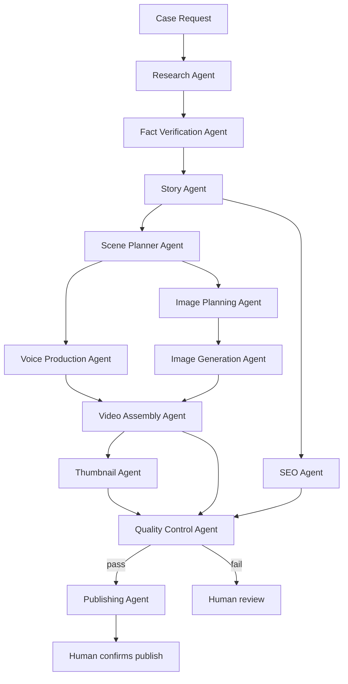

# Architecture

## What an "Agent" actually is here

The brief asks for cooperating specialized agents (Research, Story, Scene Planner, Voice,
Image, Assembly, Thumbnail, SEO, QC, Publishing, Tool Manager...). In this repo, an Agent is:

- A **system prompt** (`Agents/<name>.md`) that defines role, input schema, output schema,
  and escalation rules.
- Invoked as one **node in the orchestrator** (n8n) that calls the Anthropic API with that
  system prompt plus the current input payload.
- Stateless between calls. All "memory" is explicit: files (`SuccessRules.md`,
  `tool_registry.json`) that get read back in on the next run.

This matters because it keeps the system debuggable: every agent is a single, inspectable API
call with a fixed contract, not a black box "AI running in the background."

## Pipeline



Cross-cutting: **Tool Manager Agent** runs before any new script is written anywhere in the
pipeline — not as a pipeline stage, but as a standing check against `Tools/tool_registry.json`.

## Data contracts (which Template each stage produces/consumes)

| Stage | Produces | Consumes |
|---|---|---|
| Research | raw case data, sources | case query |
| Fact Verification | verified/flagged claims | raw case data |
| Story | `Templates/Script.md` (draft) | verified claims |
| Scene Planner | scene list (timestamps, beats) | Script.md |
| Voice Production | `Templates/Voiceover.txt` | scene list |
| Image Planning | `Templates/ImagePrompts.md` | scene list |
| Image Generation | files in `Assets/images/` | ImagePrompts.md |
| Video Assembly | draft render in `Assets/renders/` | Voiceover audio + images + timestamps |
| Thumbnail | `Templates/Thumbnail.md` | case summary/twist |
| SEO | `Templates/SEO.md` | Script.md + `Templates/SuccessRules.md` |
| Quality Control | `Templates/Checklist.md` | everything above |
| Publishing | publish plan (human-gated) | Checklist.md = pass |

`Templates/Sources.md` is written continuously by Research + Fact Verification, not as a
single stage.

## Error handling

Every agent returns:

```json
{ "status": "ok | warning | error", "output": {...}, "notes": "string" }
```

- `warning` → pipeline continues, note is logged into `Checklist.md`.
- `error` on a non-critical stage (e.g. one image failed to generate) → pipeline continues,
  missing asset flagged, never blocks the whole run.
- `error` on a critical stage (fact verification fails on a load-bearing claim, QC fails) →
  pipeline halts *that stage*, produces a report, and waits for a human decision. It does not
  silently publish a video with an unverified core claim.

## Where human judgement is required (not automatable, on purpose)

- Choosing between two viable case candidates when viral potential is close (Story Agent
  escalates instead of silently deciding — this matches how the channel's own case-selection
  disagreement, documented in `fatal-affairs-project-brief.md`, was actually resolved).
- Any QC "fail" status.
- Legal/ethical concerns about a specific case or claim.
- The final publish action (see `Agents/publishing_agent.md`) — this stays a confirm-gated
  step even in an otherwise "autonomous" pipeline, the same way an irreversible public action
  would need explicit confirmation in any other context.

## What this repo deliberately does not claim

It does not run itself. There is no persistent process anywhere in this repo that wakes up and
produces a video unattended. It is a set of contracts and scaffolds meant to be wired into a
real orchestrator (n8n) with real credentials by something with actual execution access
(Claude Code, or a human developer) — see `HANDOFF_TO_CLAUDE_CODE.md`.
