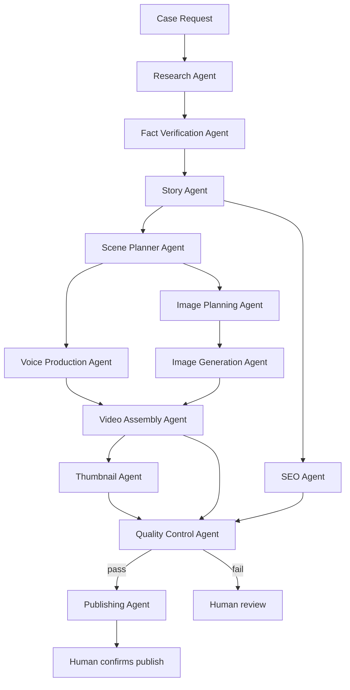

# Pipeline Overview

This mirrors `Documentation/ARCHITECTURE.md`'s diagram, written here as the operational view
for whoever builds the actual n8n workflow.

## Stage → n8n node type (suggested)

| Stage | Node type |
|---|---|
| Research | HTTP Request → Anthropic API (web_search tool enabled) |
| Fact Verification | HTTP Request → Anthropic API |
| Story | HTTP Request → Anthropic API |
| Scene Planner | HTTP Request → Anthropic API |
| Voice Production | HTTP Request → Anthropic API, then HTTP Request → ElevenLabs |
| Image Planning | HTTP Request → Anthropic API |
| Image Generation | Loop node → HTTP Request → image provider |
| Video Assembly | HTTP Request → Remotion render worker |
| Thumbnail | HTTP Request → Anthropic API, then image provider |
| SEO | HTTP Request → Anthropic API |
| Quality Control | HTTP Request → Anthropic API |
| Publishing | HTTP Request → YouTube Data API (behind a manual-approval Wait node) |
| Tool Manager | Function node reading `Tools/tool_registry.json` (via GitHub API or a synced local copy) |

## Human checkpoints (Wait/Approval nodes in n8n)

1. After Story Agent, if it flags a close call between candidate cases.
2. After Quality Control Agent, if status is `fail`.
3. Before Publishing Agent's actual upload/publish call — always, regardless of pipeline state.
